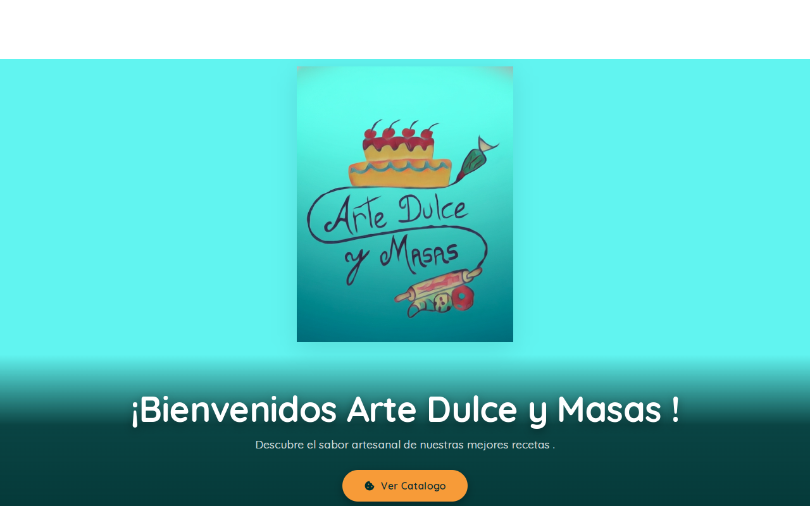
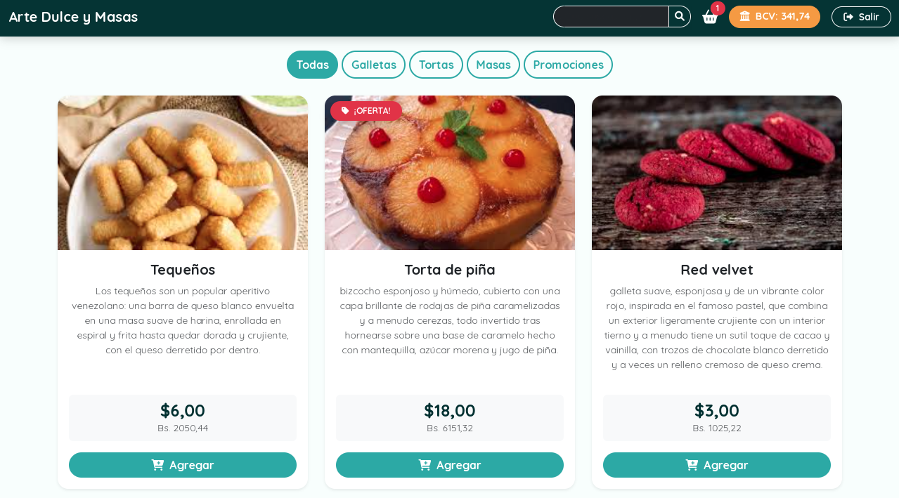
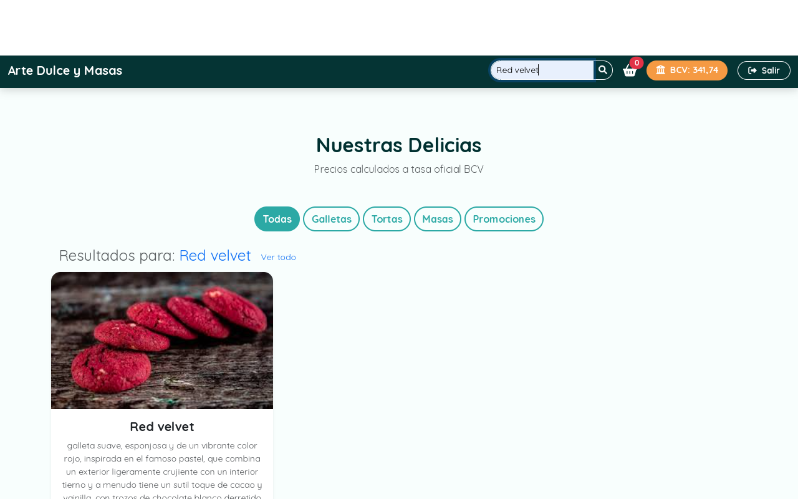
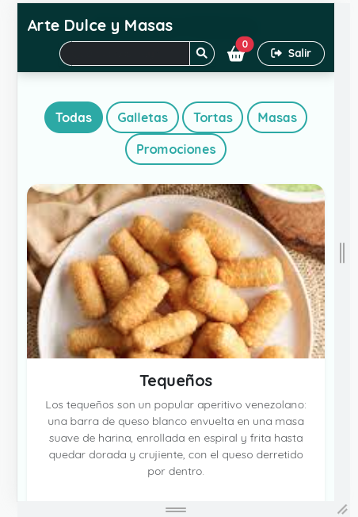
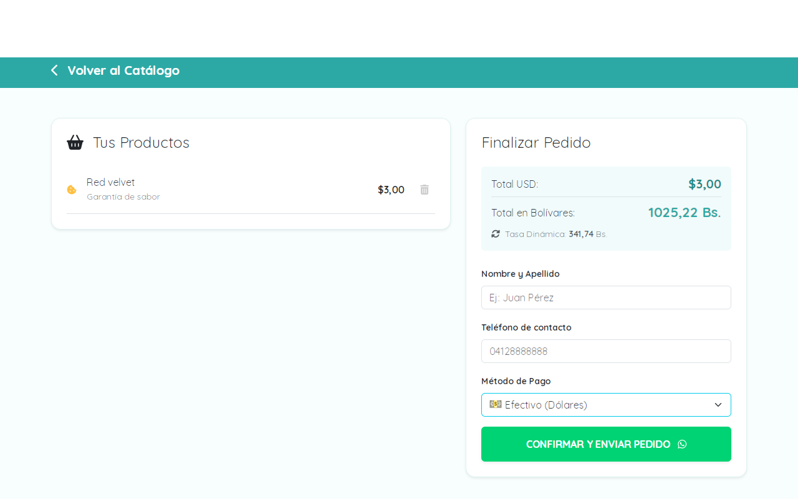

# 🥐 Arte Dulce y Masas | E-commerce Full-Stack

**Solución integral de comercio electrónico para repostería artesanal.** Una herramienta diseñada para automatizar la gestión de catálogos y optimizar el proceso de venta directa.

---

## 📸 Vista Previa (Escaparate)

### 🏠 Experiencia de Usuario e Inicio

### 🍰 Catálogo Dinámico y Buscador
| Catálogo General | Motor de Búsqueda |
|---|---|
|  |  |

### 📱 Diseño Adaptable (Responsive)

### 📋 Gestión de Carrito y Resumen de Compra

---

## 💡 Valor de Negocio (Business Value)
Este sistema resuelve necesidades críticas del comercio digital moderno:

* **🛒 Optimización de Ventas**: Carrito de compras dinámico para una experiencia de usuario fluida.
* **💱 Adaptabilidad Multimoneda**: Integración de tasa oficial **BCV** para conversión automática USD/VES en tiempo real.
* **📲 Cierre de Pedidos**: Flujo optimizado para finalizar compras directamente mediante **WhatsApp**.
* **🔐 Gestión Administrativa**: Panel de control privado para actualizar stock y precios sin tocar el código.

## 🛠️ Especificaciones Técnicas
* **Arquitectura**: Patrón MVC y Repository Pattern.
* **Backend**: Java 17 con Spring Boot y Spring Data JPA.
* **Frontend**: Thymeleaf y Bootstrap 5 (Responsivo).
* **Persistencia**: MySQL.

---
---
---
📩 **¿Interesado en digitalizar tu negocio o colaborar en un proyecto?**

* 💼 **LinkedIn**: [Darío Junior Hernández Quintero](https://www.linkedin.com/in/dario-junior-hernandez)
* 🚀 **Workana**: [Contrátame para proyectos Freelance](URL_DE_TU_WORKANA_AQUÍ)
* 📧 **Email**: [djhquintero9@gmail.com](mailto:djhquintero9@gmail.com)
